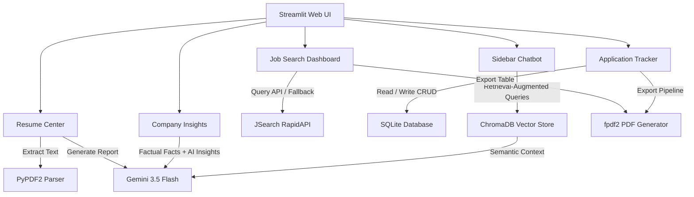

# 💼 Job Search AI Agent & Career Assistant

[](https://www.python.org/)
[](https://streamlit.io/)
[](https://deepmind.google/technologies/gemini/)

An end-to-end intelligent career ecosystem designed to help job seekers query real-time job listings, run ATS alignment audits, query career RAG knowledge guides, research companies, and track application lifecycles from a unified dashboard.

---

## 📌 Problem Statement

Finding the right career path is a complex, fragmented journey. Job seekers face two main hurdles:
1. **Search Fragmentation**: Browsing multiple job sites is inefficient, and filtering options like experience ranges, salary details, or remote work are rarely standardized.
2. **The ATS Black Box**: Over 70% of resumes are filtered out by automated Applicant Tracking Systems (ATS) before being seen by recruiters. Job seekers apply without knowing if their resumes align with keyword requirements or how to prepare for specific interviews.

The **Job Search AI Agent** bridges these gaps by combining live API-driven job search indexing with interactive Gemini AI resume-to-job matching, a persistent RAG career advice chatbot, company research insights, and a structured application tracker.

---

## ✨ Features

* **🎯 Job Search Dashboard**: Live query interface utilizing the JSearch RapidAPI. Features local advanced filtering for Work Mode (Remote vs. On-site), Experience level (Entry, Mid, Senior), Employment Type, Minimum Salary, and sorting.
* **📄 Resume Analytics**: Pure-Python in-memory PDF parsing (PyPDF2) with type and size validation (max 5MB). Offers general resume audits evaluating ATS keywords, strengths, and missing competencies.
* **📊 Resume-to-Job Matcher**: Performs interactive, side-by-side skill mapping, scores ATS compatibility (0-100), builds a skill roadmap, and suggests tailored technical questions.
* **🏢 Company Insights Research**: Synthesizes factual data (locations, website, active roles) from listings and queries Gemini AI to generate insights on workplace culture and interview advice.
* **📋 Application Lifecycle Tracker**: Lightweight, thread-safe SQLite database (`jobs_tracker.db`) to log opportunities and advance applications through Saved, Applied, Interview, Rejected, and Offer stages.
* **🤖 Career Assistant Chatbot (RAG)**: Persistent vector-store assistant powered by ChromaDB. Retrieves context from local career/interview PDFs to answer interview and resume optimization questions.
* **📥 PDF Report Export**: Compiles job search matches or application pipelines into a clean, multi-page PDF document using `fpdf2`.

---

## 🏗️ Architecture



---

## 🛠️ Tech Stack

* **Frontend Framework**: [Streamlit](https://streamlit.io/)
* **Generative Language Model**: [Google Gemini 3.5 Flash](https://deepmind.google/technologies/gemini/)
* **Vector Store & Embeddings**: [ChromaDB](https://www.trychroma.com/) / Google gemini-embedding-001
* **Database**: [SQLite](https://www.sqlite.org/) (Built-in)
* **PDF Processing**: [PyPDF2](https://pypi.org/project/PyPDF2/)
* **PDF Compilation**: [fpdf2](https://pypi.org/project/fpdf2/)
* **HTTP Client**: [Requests](https://psf.github.io/requests/)

---

## 🚀 Installation & Setup

### Prerequisites
* Python 3.9 or higher installed.
* A Google Gemini API Key (Get one from [Google AI Studio](https://aistudio.google.com/)).
* A RapidAPI Key (Get JSearch access from [RapidAPI JSearch](https://rapidapi.com/letscrape-66751536852/api/jsearch)).

### 1. Clone the Project
```bash
git clone https://github.com/vaishnavighule504-cmyk/job-search-ai-agent.git
cd job-search-ai-agent
```

### 2. Configure Virtual Environment
```bash
# Windows
python -m venv venv
venv\Scripts\activate

# macOS / Linux
python3 -m venv venv
source venv/bin/activate
```

### 3. Install Dependencies
```bash
pip install -r requirements.txt
```

---

## 🔑 Environment & Secrets Configuration

Create a file named `.streamlit/secrets.toml` in your project folder (or configure Environment Variables in Streamlit Cloud):

```toml
# .streamlit/secrets.toml
GEMINI_API_KEY = "AIzaSy..."
RAPIDAPI_KEY = "52c72..."
RAPIDAPI_HOST = "jsearch.p.rapidapi.com"
```

### Environment Variables Fallback (`.env`)
You can also create a `.env` file for local command-line tests:
```env
GEMINI_API_KEY=AIzaSy...
RAPIDAPI_KEY=52c72...
RAPIDAPI_HOST=jsearch.p.rapidapi.com
```

---

## 💻 How to Run Locally

Start the local development server:
```bash
streamlit run app.py
```
The app will open automatically in your default browser at `http://localhost:8501`.

---

## 🧠 Retrieval-Augmented Generation (RAG) Explanation

The AI Career Assistant in the sidebar utilizes RAG to deliver accurate advice referencing localized materials:
1. **Document Loading**: On startup, any PDF manuals added to the `documents/` directory (e.g. `career_guide.pdf`, `interview_guide.pdf`) are loaded.
2. **Chunking & Embeddings**: Text is split into overlapping chunks of 1000 characters and converted to 768-dimension vectors using Google's `gemini-embedding-001` model.
3. **Storage**: Vectors are indexed in a persistent ChromaDB database located in `./chroma_db` (falling back to an in-memory cosine-similarity index if ChromaDB is missing).
4. **Retrieval**: When the user enters a question, the vector store retrieves the top 5 most semantically matching text chunks.
5. **Contextual Answer**: These chunks are passed to the Gemini 3.5 Flash model alongside the query, producing a specialized, document-supported response.

---

## 📊 Job Matching Explanation

When a candidate uploads a PDF resume and clicks **Analyze Resume Fit** on any job card:
1. The app extracts resume text using the validated `pdf_reader` module.
2. The resume text and job listing metadata (title, company, description) are packaged in a structured prompt.
3. Gemini evaluates ATS alignment and returns a structured markdown payload:
   * **Match Score**: A calibrated compatibility rating displayed on a Streamlit progress bar.
   * **Side-by-Side Skill Lists**: Extracted keywords present vs. missing in the resume.
   * **Improvements**: Specific content suggestions (such as phrasing changes or action verbs).
   * **Learning Roadmap**: A sequential technical path to bridge identified skill gaps.
   * **Tailored Interview Preparation**: Specific situational questions likely to be asked for the role.

---

## 📋 Application Tracking Database Schema

The Application tracker utilizes a local SQLite database (`jobs_tracker.db`) with a simple, thread-safe structure:

```sql
CREATE TABLE IF NOT EXISTS applications (
    job_id TEXT PRIMARY KEY,
    job_title TEXT NOT NULL,
    employer_name TEXT NOT NULL,
    job_city TEXT,
    job_apply_link TEXT,
    status TEXT NOT NULL, -- 'Saved', 'Applied', 'Interview', 'Rejected', 'Offer'
    date_added TEXT,
    date_updated TEXT
);
```
Updates are committed immediately and refresh the UI via Streamlit state-reruns, allowing users to transition a job from "Saved" to "Interview" or "Offer" on the fly.

---

## 📥 PDF Export Configuration

PDF export is compiled natively without external system dependencies using `fpdf2`. It formats job titles, companies, locations, salaries, and application status strings into a clean layout. Blue underlines are applied to hyperlinks, allowing recruiters or job seekers to access original postings directly from the downloaded document.

---

## ☁️ Streamlit Cloud Deployment Instructions

1. Push the code repository to GitHub (ensuring `.gitignore` excludes your secrets and uploads).
2. Go to [Streamlit Share](https://share.streamlit.io/) and connect your GitHub account.
3. Click **New App** and select your repository, branch, and `app.py` as the entrypoint.
4. Expand the **Advanced settings** section before deploying.
5. In the **Secrets** text box, paste your API keys:
   ```toml
   GEMINI_API_KEY = "AIzaSy..."
   RAPIDAPI_KEY = "52c72..."
   RAPIDAPI_HOST = "jsearch.p.rapidapi.com"
   ```
6. Click **Deploy**.

---

## 📸 Screenshots

| Job Search & Advanced Filters | Resume Matcher & ATS Score |
| :---: | :---: |
|  |  |

---

## 👥 Team Contributions

* **Core Backend Architecture**: JSearch API integration, database module, and PDF parsers.
* **AI & Prompt Engineering**: Gemini prompt tuning, context builders, and RAG semantic embeddings.
* **Streamlit UI/UX Design**: Tabbed system navigation layout, metrics, progress bars, and style polish.

---

## ⚠️ Limitations

* **Database Volatility on Streamlit Cloud**: Since SQLite stores data in a local file, files can be reset when the Streamlit Cloud container restarts. In enterprise production, connection string updates should redirect to a cloud database (like PostgreSQL).
* **API Rate Limits**: The Gemini free tier (429 limits) and RapidAPI limits can occasionally throttle queries. Graceful fallback models catch these limits and notify users instead of showing code errors.
* **Scanned PDF Parsing**: OCR (Optical Character Recognition) is not supported. Uploaded resumes must be text-based PDFs.

---

## 🔮 Future Scope

1. **Cover Letter Generator**: Auto-generate customized cover letters using matching skills for saved listings.
2. **Calendar Integration**: Synced interview calendars to track scheduled sessions in the SQLite DB.
3. **Multiple Resume Profiles**: Support saving multiple resumes in session state for targeting different roles.
